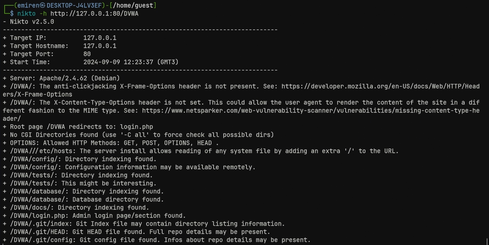
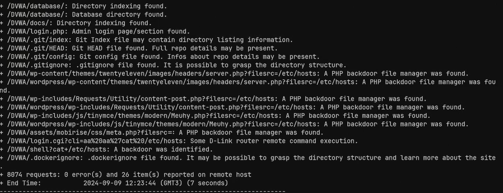

---
## Front matter
title: "Презентация по индивидуальному проекту №4"
subtitle: "НКНбд-01-21"
author: "Юсупов Эмиль Артурович"

## Generic otions
lang: ru-RU

## Formatting
toc: false
slide_level: 2
theme: metropolis
header-includes: 
 - \metroset{progressbar=frametitle,sectionpage=progressbar,numbering=fraction}
 - '\makeatletter'
 - '\beamer@ignorenonframefalse'
 - '\makeatother'
aspectratio: 43
section-titles: true
---

# Введение

## Цель работы

- Воспользоваться утилитой nikto на DVWA для выявления проблем веб-приложения.


# Выполнение работы

1. Ввели следующую команду 

```bash
nikto -h http://localhost/DVWA/
```

## Запуск nikto 



## Обнаружили множество уязвимостей у веб-приложения.



# Выводы

Во время выполнения работы, мы получили практические навыки выявления уязвимостей с помощью утилиты nikto

# Спасибо за вниманиие